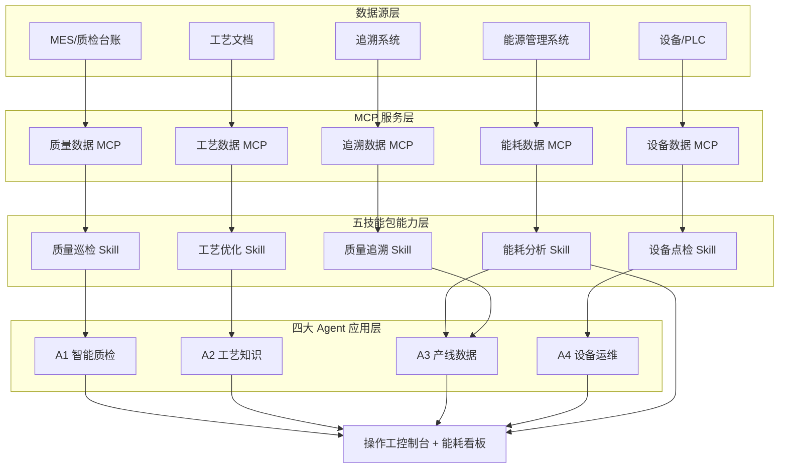

# 系统整体架构设计图

```mermaid
flowchart TB
  subgraph Data[数据源层]
    D1[设备/PLC]
    D2[MES/质检台账]
    D3[能源管理系统]
    D4[工艺文档]
    D5[追溯系统]
  end
  subgraph MCP[MCP 服务层]
    M1[设备数据 MCP]
    M2[质量数据 MCP]
    M3[能耗数据 MCP]
    M4[工艺数据 MCP]
    M5[追溯数据 MCP]
  end
  subgraph Skills[五技能包能力层]
    S1[设备点检 Skill]
    S2[质量巡检 Skill]
    S3[能耗分析 Skill]
    S4[工艺优化 Skill]
    S5[质量追溯 Skill]
  end
  subgraph Agents[四大 Agent 应用层]
    A1[A1 智能质检]
    A2[A2 工艺知识]
    A3[A3 产线数据]
    A4[A4 设备运维]
  end
  UI[操作工控制台 + 能耗看板]
  D1-->M1-->S1-->A4
  D2-->M2-->S2-->A1
  D3-->M3-->S3-->A3
  D4-->M4-->S4-->A2
  D5-->M5-->S5-->A3
  A1-->UI
  A2-->UI
  A3-->UI
  A4-->UI
  S3-->UI
```

## 分层职责

- 数据源层：企业真实业务数据或演示数据。
- MCP 服务层：统一鉴权、字段和错误合同，屏蔽 MES/PLC/能源系统差异。
- 技能包能力层：采集、阈值分析、报告和告警产物。
- Agent 应用层：以操作工动作组织能力，不暴露实现细节。
- 操作工控制台：展示结果、接收上报、下载报表并留下审计记录。

